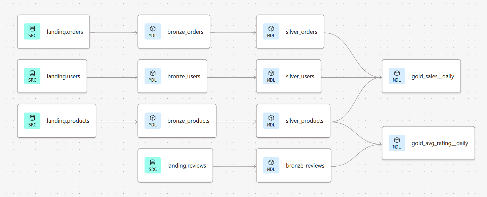

Welcome to your new dbt project!

# dbt Databricks – E-commerce Sales & Reviews

This repository contains a dbt project running on Databricks.  
It models an e-commerce dataset (users, products, orders, reviews) using a three-layer
**bronze / silver / gold** architecture with data quality tests and reusable macros.

---

## 1. Architecture overview



The lineage graph above summarizes the pipeline:

- **Bronze layer**  
  - Models: `bronze_users`, `bronze_products`, `bronze_reviews`, `bronze_orders`  
  - Purpose: ingest raw tables from the `landing` schema and apply minimal cleaning  
    (type casting, basic renaming). These models stay close to the source structure.

- **Silver layer**  
  - Models: `silver_users`, `silver_products`, `silver_orders`  
  - Purpose: produce business-ready tables based on the bronze layer using
    `ref()`. This layer standardizes column names and types, handles missing
    values and applies simple business rules. It is the main input for analytics.

- **Gold layer**  
  - Models: `gold_sales__daily`, `gold_avg_rating__daily`  
  - Purpose: provide aggregated, reporting-ready tables:
    - `gold_sales__daily`: daily sales KPIs (revenue, orders, quantities).  
    - `gold_avg_rating__daily`: daily average product rating.  
  These models are intended for BI tools and dashboards.

---

## 2. Project structure

```text
analyses/
macros/
  generate_schema_name.sql
models/
  bronze/
    bronze_users.sql
    bronze_products.sql
    bronze_reviews.sql
    bronze_orders.sql
  silver/
    silver_users.sql
    silver_products.sql
    silver_orders.sql
  gold/
    gold_sales__daily.sql
    gold_avg_rating__daily.sql
  sources/
    landing_sources.yml
seeds/
snapshots/
tests/
  test_qtty_and_price_more_than_zero.sql
dbt_project.yml
README.md


### Resources:
- Learn more about dbt [in the docs](https://docs.getdbt.com/docs/introduction)
- Check out [Discourse](https://discourse.getdbt.com/) for commonly asked questions and answers
- Join the [dbt community](https://getdbt.com/community) to learn from other analytics engineers
- Find [dbt events](https://events.getdbt.com) near you
- Check out [the blog](https://blog.getdbt.com/) for the latest news on dbt's development and best practices
"# dbt_databricks__sales__ecommerce_project" 
